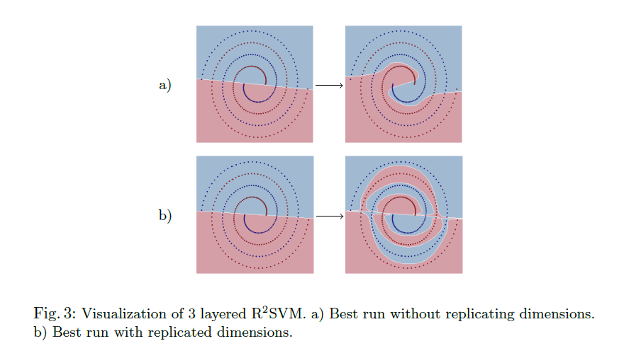
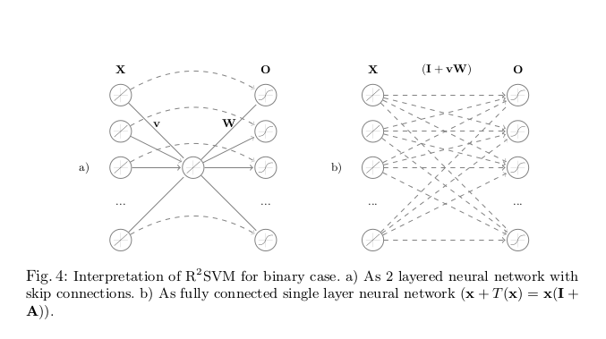

# On certain limitations of Recursive Representation Models

This repository contains code for "On certain limitations of Recursive Representation Models" paper. You can also find here implementations of models from [Learning with Recursive Perceptual Representations](http://daggerfs.com/assets/pdf/nips12_rsvm.pdf) and [Learning deep representations via extreme learning machines](http://www.sciencedirect.com/science/article/pii/S0925231214011461).

<center>
</img>

</img>
</center>

## R2SVMLearner and R2ELMLearner

If you are primarly interested in implementations of those models you need only `r2.py` file, where you will also find simple tests. Implementation follows scikit-learn convention, but note there might be some problems with methods using `set_params` call. Bear in mind that this is just research implementation.

## Reproducing results

For reproducing results you need to fit all the models. Change `n_jobs` parameter to speed up computation. 

* Fit SVM, Linear SVM and SVM RBF

```{python}
python scripts/fit_extern.py 
```

* Fit R2SVM and DrELM

```{python}
python scripts/fit_r2.py
```

* Fit some models on tripled datasets

```{python}
python scripts/fit_triple.py
```

* Fit randomized versions of R2M models

```{python}
python scripts/fit_random.py
```
